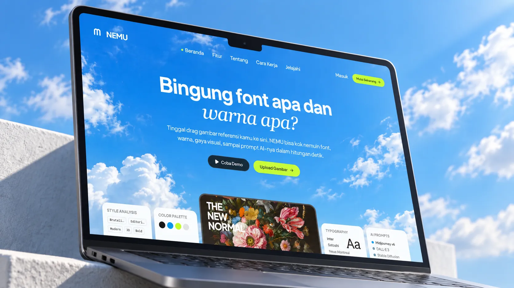

# NEMU - Visual Reference Intelligence

> Bedah gaya, warna, font, dan Visual DNA dari referensi desain dalam hitungan detik.

---

## Tentang Proyek

Repositori ini merupakan **Public Portfolio Showcase** resmi untuk platform **NEMU**. Repositori ini memuat implementasi frontend antarmuka interaktif secara penuh, arsitektur sistem komprehensif, serta panduan integrasi teknologi.

Untuk melindungi rahasia dagang, model prompt rekayasa AI, serta logika kuantisasi warna proprietary, implementasi backend disajikan dalam bentuk dokumentasi arsitektur dan spesifikasi API pada direktori [server/](server/). Aplikasi aktif yang terhubung penuh ke cloud backend dapat dicoba langsung melalui [Live Demo](https://nemu-in.vercel.app).

---

## Masalah yang Dipecahkan

Sebagai desainer grafis, UI/UX desainer, kreator konten, atau art director, proses mengumpulkan inspirasi visual dari Pinterest, Behance, atau Instagram sering kali menyisakan tanda tanya teknis:
1. **Identifikasi Aliran Desain Sulit Didefinisikan**: Desainer menyukai mood sebuah karya, namun kesulitan menentukan apakah itu *Neo-Brutalism*, *Swiss International Style*, *Acid Graphic*, atau *Y2K Grunge*.
2. **Pencarian Font Memakan Waktu**: Mengetahui nama jenis font pada karya referensi sering kali membutuhkan reverse-search berulang, dan font yang ditemukan kerap berbayar atau sulit diakses secara resmi.
3. **Rekayasa Ulang Vibe ke AI Masih Abstrak**: Menerjemahkan komposisi, pencahayaan, dan tone warna referensi menjadi prompt AI yang efektif (seperti Midjourney atau DALL-E) membutuhkan teknik prompt engineering visual yang rumit.

**NEMU** hadir sebagai solusi cerdas yang mendekonstruksi setiap gambar referensi menjadi **Visual DNA** yang terstruktur, edukatif, dan langsung siap diaplikasikan ke dalam alur kerja kreatif nyata.

---

## Fitur Unggulan

### 1. Dekonstruksi Aliran & Karakteristik Desain
Sistem menganalisis komposisi visual secara mendalam untuk mengidentifikasi era dan gaya desain utama. Hasil analisis disajikan dengan bahasa Indonesia santai khas komunitas desainer, lengkap dengan *mood keywords*, karakteristik pencahayaan, palet estetika, dan tekstur fisik karya.

### 2. Pendeteksi Tipografi & Kurasi Padanan Google Fonts Gratis
NEMU mendeteksi teks yang terlihat pada gambar, mengenali struktur anatomi huruf (kontras garis, ketebalan, proporsi, serta kategori serif/sans-serif), lalu memberikan rekomendasi padanan font yang 100% gratis dan legal di Google Fonts: lengkap dengan arena pengujian tipografi langsung (*live tester playground*).

### 3. Studio Prompt Rekayasa AI Siap Pakai
Untuk mempermudah eksplorasi variasi desain, sistem merumuskan prompt terstruktur yang siap disalin ke generator AI seperti Midjourney atau DALL-E tanpa perlu menyusun parameter manual dari awal, dilengkapi kata kunci kurasi untuk penelusuran lebih lanjut di Pinterest.

---

## Fitur Pendukung Lainnya

* **Kuantisasi Piksel Nyata & Audit Kontras WCAG**: Ekstraksi warna berbasis pembacaan ~16.000 sampel piksel raster dengan deteksi otomatis warna kanvas latar belakang untuk memastikan akurasi swatch warna dan tingkat keterbacaan kontras standar WCAG.
* **Klasifikasi Media Adaptif**: Respons sistem menyesuaikan secara cerdas berdasarkan kategori input (Desain Grafis Poster, Antarmuka UI & Sosmed, Fotografi Artistik murni, atau Aset Ilustrasi).
* **Ekspor Kartu Aset Resolusi Tinggi**: Fitur ekspor ringkasan Visual DNA ke dalam format kartu PNG 16:9 yang rapi untuk dibagikan ke tim desain atau klien, dioptimalkan dengan inlined base64 rendering lintas peramban.
* **Sistem Kuota Ramah Pengguna**: Pengunjung baru langsung mendapatkan 3 kredit gratis tanpa perlu registrasi akun, dengan integrasi Google OAuth melalui Clerk untuk kemudahan akses lanjutan.

---

## Tech Stack

### Frontend
* **Framework**: React 19 + Vite
* **Styling**: Tailwind CSS v4
* **Komponen Ikon**: Lucide React
* **Rendering Aset**: html-to-image
* **Autentikasi**: Clerk React SDK

### Backend & Layanan Cloud
* **Runtime**: Node.js & Express.js
* **Database**: MongoDB & Mongoose ODM
* **Penyimpanan Media**: Cloudinary SDK
* **Inference AI**: OpenRouter Multimodal Vision API
* **Keamanan**: Helmet, Express Rate Limit, JWT

---

---

## Hak Cipta & Kepemilikan

Hak cipta seluruh konsep produk, identitas merek, desain antarmuka, serta metodologi analisis Visual DNA dimiliki oleh pembuat proyek. Dibuat dengan dedikasi untuk mendukung ekosistem kreatif dan desainer visual Indonesia.
